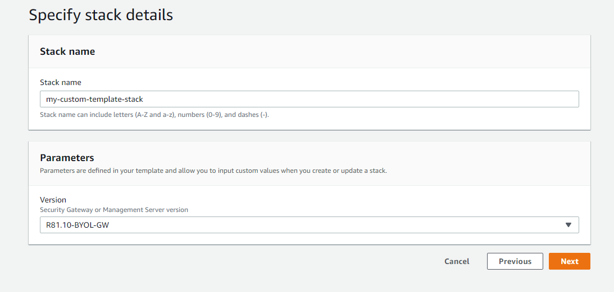

# AWS CloudFormation Templates

[CloudFormation](https://docs.aws.amazon.com/AWSCloudFormation/latest/UserGuide/Welcome.html) is an Amazon Web Services (AWS) service that enables modeling and setting up resources inside AWS in an automated fashion.

The table below lists CloudFormation templates provided and maintained by Check Point that simplify the deployment of Check Point security solutions in AWS.  

You can use these templates as-is or as building blocks for customizing your own templates.

**Notes:**

* You must accept the Software Terms of the relevant Check Point Product AMI in the [AWS Marketplace](https://aws.amazon.com/marketplace/) at least once prior to launching the CloudFormation templates. It is not required to actually launch the instance from the Marketplace, but the agreement must be accepted from this location.

* Some stacks may "roll back" automatically after 1 hour, with an error "WaitCondition timed out" If this happens, please check Internet access is working, either through AWS (Internet Gateway (IGW) assigned to the VPC, routetables with a default route and assigned to the relevant subnet(s), and Elastic IP (EIP) assigned, etc), or through another method like external proxy, or route to on-prem, for example. 

# Manual Deployment
In case you want to deploy a custom template that is not listed follow this steps:
1. ## Create Stack
    When in the CloudFormation service, click on "Create stack" button.
    

2. ## Upload desired template
    Use this menu to upload your custom template (yaml/json file)
    
    After the file is uploaded, click next.

3. ## Specify stack details
    In this menu you'll need to specify the custom parameters for your template based on the template that you've uploaded.
    
    When you done, click next.

4. ## Configure stack options
    If you need to configure your stack options (e.g. tags, iam role, and etc.) you can do it in this menu. 
    Click next to move to the review page.

5. ## Review and create stack.
    In this window, make sure all configured correctly. 
    If everything is correct, press "Create stack" and deploy the stack.

